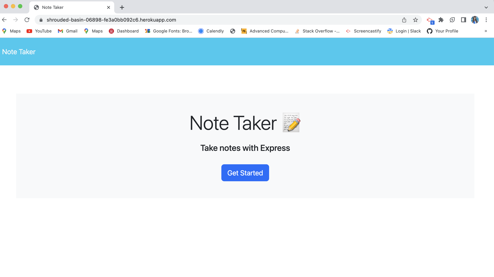
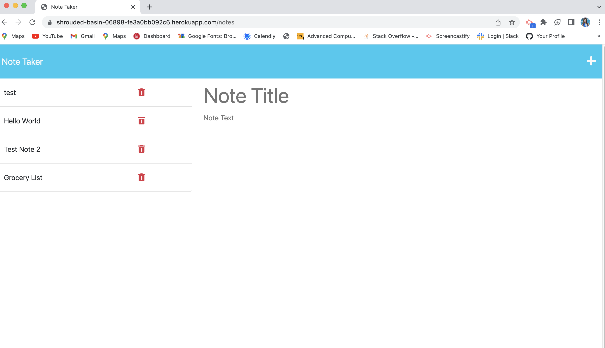

# note-taker

## Description
This project was created for users to write and save notes in order to more efficiently keep track of tasks that need to be completed. 

## Installation
N/A

## Usage
Open Heroku link for the deployed appliccation. Click on the 'Get started button' to go to the notes page. In the notes page, create a note by adding a title and adding text to the 'text area.' Save the note to add it to the saved notes section. Press the 'trashcan' to delete notes. 

https://shrouded-basin-06898-fe3a0bb092c6.herokuapp.com/

## Credits
Matthew Calimbas- Tutor

## License
MIT License

Copyright (c) 2023 Lilibeth Neal (Mejia)

Permission is hereby granted, free of charge, to any person obtaining a copy of this software and associated documentation files (the "Software"), to deal in the Software without restriction, including without limitation the rights to use, copy, modify, merge, publish, distribute, sublicense, and/or sell copies of the Software, and to permit persons to whom the Software is furnished to do so, subject to the following conditions:

The above copyright notice and this permission notice shall be included in all copies or substantial portions of the Software.

THE SOFTWARE IS PROVIDED "AS IS", WITHOUT WARRANTY OF ANY KIND, EXPRESS OR IMPLIED, INCLUDING BUT NOT LIMITED TO THE WARRANTIES OF MERCHANTABILITY, FITNESS FOR A PARTICULAR PURPOSE AND NONINFRINGEMENT. IN NO EVENT SHALL THE AUTHORS OR COPYRIGHT HOLDERS BE LIABLE FOR ANY CLAIM, DAMAGES OR OTHER LIABILITY, WHETHER IN AN ACTION OF CONTRACT, TORT OR OTHERWISE, ARISING FROM, OUT OF OR IN CONNECTION WITH THE SOFTWARE OR THE USE OR OTHER DEALINGS IN THE SOFTWARE.

